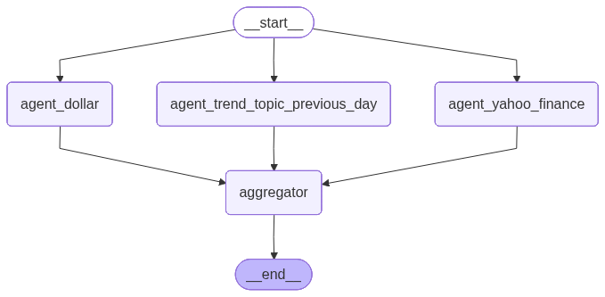

# 🤖 LangGraph Local Workflow

Este projeto demonstra como criar workflows inteligentes usando **LangGraph** com **LLM local (Ollama)** para processamento paralelo de dados financeiros e notícias. O sistema utiliza agentes especializados que executam tarefas concorrentemente e agregam os resultados em um relatório consolidado.

## 📋 Índice

- [Sobre o Projeto](#sobre-o-projeto)
- [Arquitetura](#arquitetura)
- [Pré-requisitos](#pré-requisitos)
- [Instalação](#instalação)
- [Configuração](#configuração)
- [Uso](#uso)
- [Estrutura do Projeto](#estrutura-do-projeto)
- [Workflows](#workflows)
- [Agentes Disponíveis](#agentes-disponíveis)
- [Ferramentas](#ferramentas)
- [Contribuindo](#contribuindo)

## 🎯 Sobre o Projeto

Este projeto implementa um **workflow multi-agente** usando LangGraph que:

- **Executa em paralelo** três agentes especializados
- **Usa LLM local** (Ollama) para maior privacidade e controle
- **Agrega dados** de diferentes fontes (cotação do dólar, ações, notícias)
- **Demonstra** padrões avançados de orquestração de agentes

### Por que LLM Local?

✅ **Privacidade**: Seus dados não saem do seu ambiente  
✅ **Controle**: Você escolhe qual modelo usar  
✅ **Custo**: Sem custos de API externa  
✅ **Latência**: Processamento local mais rápido  
✅ **Disponibilidade**: Funciona offline  

## 🏗️ Arquitetura

### Workflow Visual


### Grafo LangGraph


O sistema utiliza uma arquitetura baseada em **grafo dirigido acíclico (DAG)** onde:

1. **Três agentes executam em paralelo**:
   - Agent Dollar: Busca cotação do dólar
   - Agent Yahoo Finance: Busca preços de ações
   - Agent Notices: Busca notícias trending

2. **Um agregador consolida os resultados**

3. **LangGraph coordena** a execução e fluxo de dados

## 🔧 Pré-requisitos

### Sistema
- Python 3.12+
- macOS, Linux ou WSL2 (Windows)

### Ollama
Você precisa ter o Ollama instalado e configurado:

```bash
# Instalar Ollama
curl -fsSL https://ollama.ai/install.sh | sh

# Baixar o modelo (padrão: qwen2.5:0.5b)
ollama pull qwen2.5:0.5b

# Verificar se está rodando
ollama list
```

### APIs Externas
- **News API**: Para buscar notícias (obtenha sua chave em https://newsapi.org/)

## 📦 Instalação

### 1. Clone o Repositório
```bash
git clone https://github.com/Leonardojdss/LangGraph-Local-Workflow.git
cd LangGraph-Local-Workflow
```

### 2. Crie o Ambiente Virtual
```bash
python -m venv env
source env/bin/activate  # No Windows: env\Scripts\activate
```

### 3. Instale as Dependências
```bash
pip install -r requirements.txt
```

*Principais dependências:*
- `langgraph`: Framework de workflow
- `langchain-ollama`: Integração com Ollama
- `yfinance`: Dados financeiros
- `requests`: Requisições HTTP
- `python-dotenv`: Gerenciamento de variáveis de ambiente

## ⚙️ Configuração

### 1. Variáveis de Ambiente
Crie um arquivo `.env` na raiz do projeto:

```env
# News API Key (obrigatório para notícias)
KEY_NEWS_API=sua_chave_aqui
```

### 2. Configurar Modelo Ollama
No arquivo `src/infrastructure/connection_ollama.py`, você pode alterar:

```python
def __init__(self, model: str = "qwen2.5:0.5b", temperature: int = 0):
```

**Modelos recomendados:**
- `qwen2.5:0.5b` - Rápido, menor uso de memória
- `llama3.2:3b` - Balanceado

### 3. Testar Conexão
```bash
# Verificar se o Ollama está rodando
ollama ps

# Testar o modelo
ollama run qwen2.5:0.5b "Hello world"
```

## 🚀 Uso

### Execução Básica
```bash
# Ativar ambiente virtual
source env/bin/activate

# Executar o workflow
python src/main.py
```

### Exemplo de Saída
```
Dólar: A cotação do dólar para compra é 5.45 reais e para venda é 5.47 reais em 2024-09-24.
Ações: MSFT: $420.50, GOOG: $165.30, AAPL: $190.85
Notícias: As principais notícias incluem desenvolvimentos em IA, mercado financeiro...
```

## 📁 Estrutura do Projeto

```
LangGraph-Local-Workflow/
├── src/
│   ├── main.py                    # Ponto de entrada
│   ├── infrastructure/
│   │   └── connection_ollama.py   # Conexão com Ollama
│   ├── utils/
│   │   └── image_graph.py         # Utilitários para visualização
│   └── workflow/
│       ├── agents.py              # Definição dos agentes
│       ├── graph.py               # Configuração do grafo LangGraph
│       ├── nodes.py               # Nós do workflow (State + Nodes)
│       └── tools.py               # Ferramentas dos agentes
├── env/                           # Ambiente virtual Python
├── image.png                      # Diagrama do workflow
├── workflow_graph.png             # Visualização do grafo
└── README.md
```

## 📝 Licença

Este projeto está sob a licença MIT. Veja o arquivo `LICENSE` para detalhes.

## 🔗 Links Úteis

- [LangGraph Documentation](https://langchain-ai.github.io/langgraph/)
- [Ollama Models](https://ollama.ai/library)
- [LangChain Ollama](https://python.langchain.com/docs/integrations/llms/ollama)
- [News API](https://newsapi.org/docs)

---